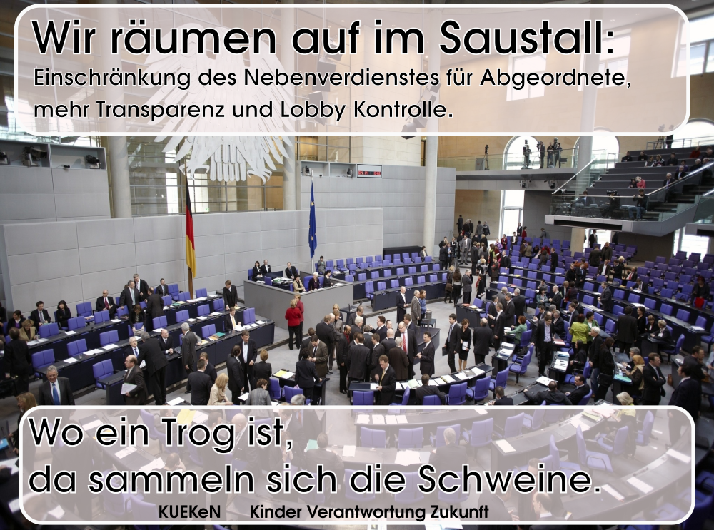

Mit leerem Herzen ist unsere Populismus Reihe, ein leere Herz attestiert
Paul Taggart dem Populismus, der für ihn ein Relationsbegriff und damit
substanzlos ist. Der Populismus demnach braucht immer eine Abgrenzung,
immer ein Anderes als Gegner. Er ist polarisierend. Damit ist der
Populismus immer verkürzend und noch wichtiger immer ausschließend.
Politik darf jedoch nicht ausschließen sie muss einschließen.

Unsere Politischen Forderungen sollen immer Herzlich sein, also mit
vollem Herzen.

\[1\]Paul Taggart: Populism. Open University Press,
Buckingham/Philadelphia 2000, zitiert nach van Kessel: Populist Parties
in Europe. 2015, S. 7

Hier ein paar Beispiele:

**AFD** 

Hier gibt es keine Herzlichkeit.

**Lobbykontrolle**

Wir räumen auf im Saustall:

Einschränkung des Nebenverdienstes für Abgeordnete, Transparenz und
Lobby Kontrolle.

Wo ein Trog ist da sammeln sich die Schweine.

Herzlich ließt sich die Forderung so:

*Als Menschen orientieren wir uns an anderen Menschen, das machen wir
seit Geburt an. So orientieren wir uns auch an unseren Politikern. Es
muss Politikern daher leicht gemacht werden sich vorbildlich zu
benehmen, um ein gutes Beispiel zu geben. Dafür braucht es strenge
Regeln. Einschränkung des Nebenverdienstes für Abgeordnete, Transparenz
und Lobby Kontrolle. Wir schließen uns hier den Forderungen von
lobbycontrol an.*

<https://www.lobbycontrol.de/wp-content/uploads/LobbyControl-Positonspapier.pdf>
