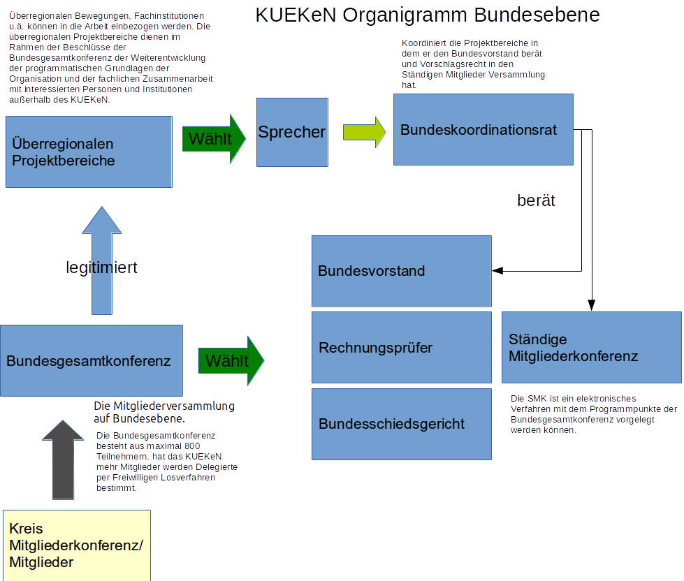

Eine Darstellung der Strukturen des KUKeN.

Gliederungen
------------

-   Bund
-   Land
-   Keis/Bezirk

Organe im Bund
--------------

Eine Übersicht über die Organe der Partei und ihr Zusammenspiel.

  

### [Bundesgesamtkonferenz](/wiki/Bundesgesamtkonferenz "wikilink")

[ §10 Die
Bundesgesamtkonferenz](/wiki/Satzung#.C2.A7_10_Die_Bundesgesamtkonferenz "wikilink")

[ Geschäftsordnung der
Bundesgesamtkonferenz](/wiki/Go_Bundesgesamtkonferenz "wikilink")

### [Bundesvorstand](/wiki/Bundesvorstand "wikilink")

[ §11 Der
Bundesvorstand](/wiki/Satzung#.C2.A7_11_Der_Bundesvorstand "wikilink")

### [ Ständige Mitgliederkonferenz](/wiki/Ständige_Mitgliederkonferenz "wikilink")

Die ständige Mitgliederkonferenz gehört zum Konzept der sog.
\[<https://de.wikipedia.org/wiki/Liquid_Democracy>\| Liquid Democracy\].
Sie soll allen Mitgliedern ermöglichen sich an Programm und Struktur
Arbeiten zu beteiligen.

Der [ Geschäftsordungsentwurf](go_smk "wikilink") in der ersten Version.

Klassische Software Systeme mit einer zentralen Instanz:

-   <http://www.liquidfeedback.org/>
-   <https://adhocracy.de/>
-   <http://democracyos.org/>

Seit Einführung der Blockchain Technologie wird auch an einen
dezentralen, transparenten Voting System gearbeitet. Z.B.
\[<https://medium.com/@DomSchiener/publicvotes-ethereum-based-voting-application-3b691488b926#.xzuc2k8u6>\|
PublicVotes: Ethereum-based Voting Application\]

Durch die Verwendung von
\[<https://en.wikipedia.org/wiki/Ring_signature>\| Ring Signaturen\] und
der dezentralen Blockchain ist es möglich den Widerspruch von
\[<https://de.wikipedia.org/wiki/Liquid_Democracy#Unm.C3.B6glichkeit.2C_geheime_und_zugleich_nicht_manipulierbare_Abstimmungen_durchzuf.C3.BChren>\|
elektronisch, transparent und geheim\] aufzulösen.

### Die überregionalen Projektbereiche

-   [Frieden](/wiki/Frieden "wikilink")
-   Sozialer Wohnungsbau
-   Bildung
-   Grundeinkommen

### [Bundesschiedsgericht](/wiki/Bundesschiedsgericht "wikilink")

[ Schiedsgerichtsordnung](/wiki/Schiedsgerichtsordnung_Bund "wikilink")

Zusammenfassung
---------------

{{\#ask:[Kategorie:Parteiorganisation](/wiki/Kategorie:Parteiorganisation "wikilink")

\|?Ist definiert in Satzung \|?Hat Geschäftsordnung \|?In Gliederung
\|?Hat Mitglieder \|format=table \|link=all \|headers=show
\|searchlabel=… weitere Ergebnisse \|class=sortable wikitable smwtable
}}
